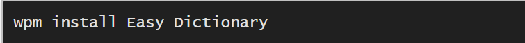
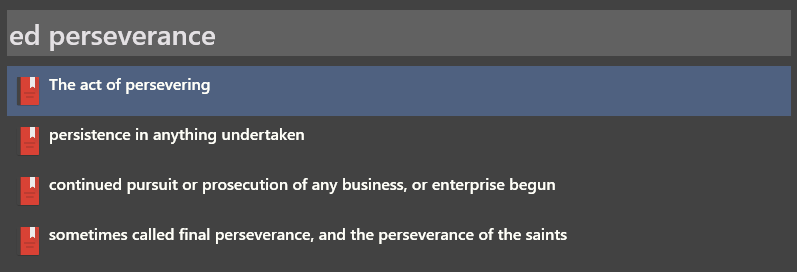
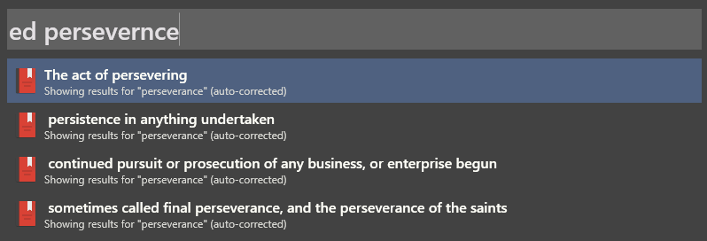

# Easy Dictionary

This repository provides an offline English Dictionary plugin based on Webster's Unabridged English Dictionary for [*Wox*](http://www.wox.one/) ([*GitHub Repository*](https://github.com/Wox-launcher/Wox)).

Easy Dictionary Plugin also available on Wox's website: [*http://www.wox.one/plugin/351*](http://www.wox.one/plugin/351)

## Contributions
1. **Dictionary Data**:
The `dictionary_compact_with_words.json` file provides the dictionary content used by the plugin. This `dictionary_compact_with_words.json` file is a modified form of `dictionary_compact.json` file sourced from GitHub project [*WebstersEnglishDictionary*](https://github.com/matthewreagan/WebstersEnglishDictionary) that in turn sources the dictionary content from [*Project Gutenberg's*](https://www.gutenberg.org/) [*Webster's Unabridged English Dictionary*](https://www.gutenberg.org/ebooks/29765).

2. **Auto Correction**:
With v2.0.0 onwards Easy Dictionary will auto-correct mis-typed words. `Spell.py` is used to find most probable auto-corrected word. `Spell.py` is sourced from [Peter Norvig's website Norvig.com](https://norvig.com/spell-correct.html). The file is modified a bit for the current use case.

## Installation Instructions
Before installing this plugin, make sure that you have `Python3` installed and `Python Directory` is set in `Wox Settings -> General -> Python Directory` to installed Python's path.

#### Method 1
- Install directly using Wox: `wpm install Easy Dictionary`

#### Method 2
- Drag and Drop the `Wox.Plugin.eDict.wox` onto the Wox Launcher
#### Method 3
- Download and copy this repository from [*Releases*](https://github.com/ashu-tosh-kumar/Wox.Plugin.eDict/releases) to Wox's Plugin directory (*Go to Wox Settings, select any installed plugin and click on Plugin Directory to quickly find the plugin directory*).
- **Note**: Only `Images Folder`, `dictionary_compact_with_words.json`, `spell.py`, `main.py` and `plugin.json` are required to be copied.

## Usage
- Simply launch Wox, type `ed`, give space and start typing the word!
- `auto-corrected` shows that the query is auto-corrected.

